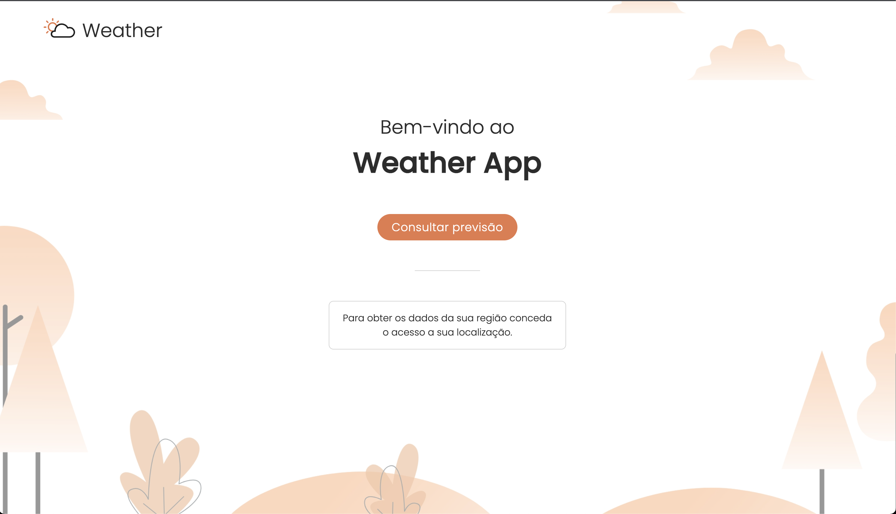
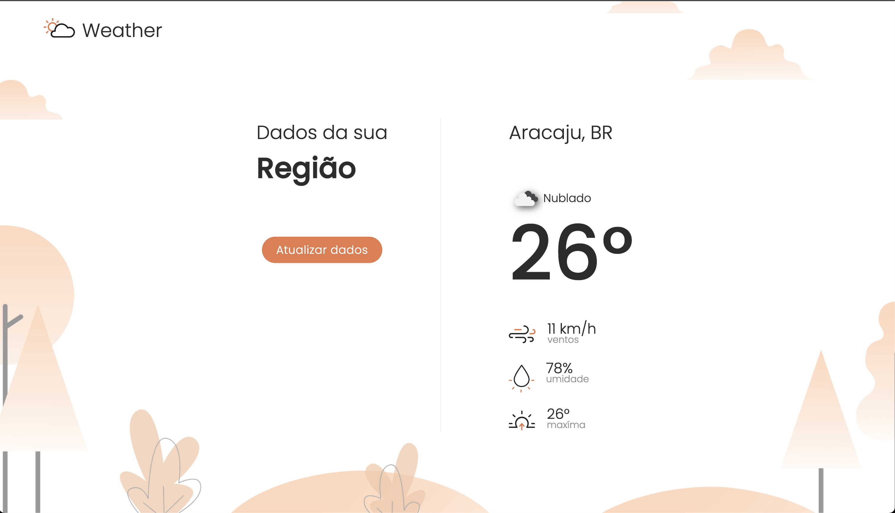

# Weather App


[](https://app.netlify.com/sites/weather-app-br/deploys)


Aplicação para consulta dos dados climáticos da sua localização atual.





Para acesso a aplicação utilizar o link a seguir [Weather App](https://weather-app-br.netlify.app).

Stack utilizada no desenvolvimento:
* TypeScript
* React
* Next.js
* Jest
* React Testing Library
* ESlint
* Prettier
* Continuos Integration
  * Github Actions (**build, lint, test**)

# Configuração inicial

Execute os passos abaixo para realizar a configuração inicial da aplicação.


### 1 - Variáveis de ambiente

Crie uma cópia do arquivo .env.example e e renomeie para .env

```bash
cp .env.example .env
```

Edite o arquivo criado no passo anterior e informe a Api Id

```bash
WEATHER_APP_ID=9d62fceb781927c0e938f62f25a45e77
```


### 2 - Instalação das dependências

Para instalar as dependências da aplicação execute o comando abaixo:

```bash
yarn
```

# Scripts disponíveis

### Execução em modo de desenvolvimento

```bash
yarn dev
```

### Executar linter do código

```bash
yarn lint
```

### Criar build de produção

```bash
yarn build
```

### Executar testes

```bash
yarn test
```
